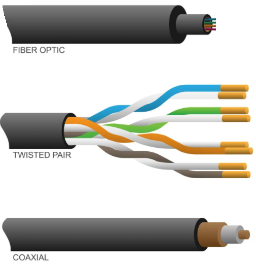
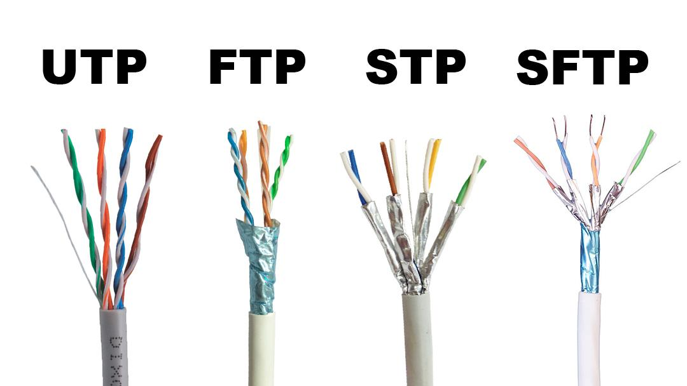
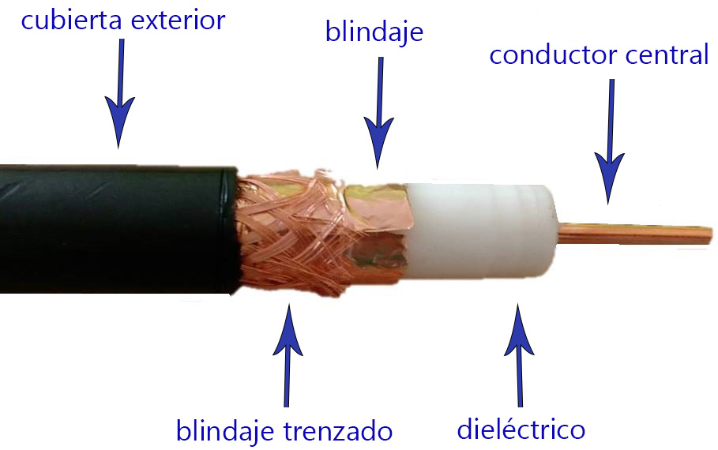
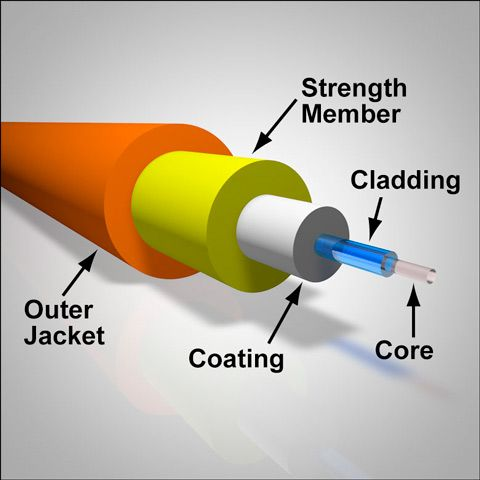

# MEDIOS GUIADOS
 
Los **medios guiados** son aquellos que conducen la señal a través de un soporte físico sólido que se encarga de transportar la señal de información sin que ésta sobrepase las fronteras físicas del medio.

Los medios  guiados pueden transportar señales formadas por ondas electromagnéticas o por señales ópticas.

Los principales son:

* Cables de cobre  -->  pulsos electromagnéticos
  * Par trenzado
  * Cable coaxial
* Fibra óptica --> pulsos de luz (señal óptica)
  

## PAR TRENZADO

El cable de par trenzado consiste en dos alambres de cobre aislados que se trenzan de forma helicoidal, igual que una molécula de ADN. La forma trenzada permite reducir interferencias electromagnéticas. 

Este tipo de cable es muy usuado en redes Ethernet (Cat 5e, Cat 6, Cat 6a...).

Las redes utilizan medios de cobre porque son económicos y fáciles de instalar, y tienen baja resistencia a la corriente eléctrica. Sin embargo, los medios de cobre se ven limitados por la distancia y la interferencia de señales. Cuanto más lejos viaja una señal, más se deteriora. Esto se denomina **atenuación** de señal.

Un cable de par trenzado está formado por un grupo de pares trenzados, normalmente cuatro, recubiertos por un material aislante. Cada uno de estos pares se identifica mediante un color.

Según las protecciones frente a interferencias y a ruidos de la que dispongan, los cables de pares trenzados se clasifican en 4 tipos, de menor a mayor calidad y precio:

* UTP: No tiene protección.
* FTP: Tiene protección global.
* STP: Tiene protección por cada par.
* SFTP: Tiene protección global y por cada par

Los cables UTP generalmente se terminan con un conector RJ-45.

Investiga los diferentes tipos de par trenzado en este [enlace](https://www.redeszone.net/tutoriales/redes-cable/guia-cable-red-ethernet-elegir/)

## CABLE COAXIAL

Es un cable utilizado para transportar señales eléctricas de alta frecuencia que posee dos conductores concéntricos, uno central, **núcleo**, encargado de llevar la información, y uno exterior, de aspecto tubular, llamado **malla**, blindaje o trenza, que sirve como referencia de tierra y retorno de las corrientes. Entre ambos se encuentra una capa aislante llamada **dieléctrico**, de cuyas características dependerá principalmente la calidad del cable. Todo el conjunto suele estar protegido por una cubierta aislante (también denominada chaqueta exterior).

Era usado en televisión por cable y antiguas redes Ethernet pero debido a la necesidad de manejar frecuencias cada vez más altas y a la digitalización de las transmisiones, se ha sustituido paulatinamente por el cable fibra óptica, en particular para distancias superiores a varios kilómetros, porque el ancho de banda es muy superior.

La conexión de cable coaxial requiere la utilización de unos conectores especiales. Los más utilizados son los denominados conectores **BNC**.

## FIBRA ÓPTICA
Transmite datos mediante **pulsos de luz** en lugar de señales eléctricas.

Un cable de fibra óptica tiene forma cilíndrica y está formado por tres secciones concéntricas: **núcleo** o *core*, **revestimiento** o *cladding* y **recubrimiento** o *coating*. El núcleo es la sección más interna; está constituido por una o varias fibras de cristal o plástico. La luz viaja a través del núcleo, el cual está envuelto por un revestimiento que evita la dispersión de la luz. El recubrimiento actúa de protección contra el deterioro y la humedad.

Cuando las señales de luz se envían a través del cable de fibra óptica, se reflejan en el núcleo y el revestimiento en una serie de rebotes en zig-zag, adhiriéndose a un proceso llamado **reflexión interna total**.

Existen dos tipos de cable de fibra óptica:
* **Monomodo**. Usado para distancias más largas debido al diámetro más pequeño del núcleo de fibra de vidrio, lo que disminuye la posibilidad de atenuación. La abertura más pequeña aísla la luz en un solo haz, que ofrece una ruta más directa y permite que la señal viaje una distancia más larga. También tiene un ancho de banda mayor. La fuente de luz utilizada para la fibra monomodo es típicamente un **láser**.
* **Multimodo**. Se usa para distancias más cortas porque la abertura central más grande permite que las señales de luz reboten y se reflejen más en el camino. El diámetro más grande permite enviar múltiples pulsos de luz a través del cable al mismo tiempo, lo que da como resultado una mayor transmisión de datos. Sin embargo, esto también significa que hay más posibilidades de pérdida de señal, reducción o interferencia. La fibra óptica multimodo generalmente usa un **LED** para crear el pulso de luz. 
  
* * *
### COMPARATIVA
Antes de hacer la instalación, es importante decidir cuál será el cableado  más adecuado, ya que, aunque sólo supone el 6% del coste total de la instalación, el 70% de los fallos producidos en una red se deben al cableado.

¿Cómo elegir el cableado de red adecuado para tu negocio?

La elección del tipo de cableado correcto no es una decisión que deba tomarse a la ligera. 

Factores deben tenerse en cuenta:

* Necesidades de <ins>Ancho de Banda</ins>: ¿Qué cantidad de datos necesitas transmitir actualmente y cuáles son tus previsiones de crecimiento?
* <ins>Distancia</ins>: ¿Qué distancias deben cubrir los cables dentro de tu oficina o edificio?
* <ins>Presupuesto</ins>: ¿Cuál es tu presupuesto para la instalación del cableado de red?
* <ins>Entorno</ins>: ¿Existen fuentes de interferencia electromagnética en tu entorno que puedan afectar al rendimiento del cableado?
* <ins>Escalabilidad</ins>: ¿Necesitas una solución que pueda adaptarse fácilmente a futuras expansiones de tu red?

| Medio                    | Tipo de señal | Velocidad máx. aprox.  | Distancia máx.    | Inmunidad al ruido | Costo | Uso típico                 |
| ------------------------ | ------------- | ---------------------- | ----------------- | ------------------ | ----- | -------------------------- |
| **Par trenzado UTP/STP** | Eléctrica     | Hasta 10 Gbps (Cat 6a) | 100 m             | Media              | Bajo  | LAN, oficinas              |
| **Cable coaxial**        | Eléctrica     | Hasta 1 Gbps           | 500 m             | Alta               | Medio | TV por cable, CCTV         |
| **Fibra óptica**         | Óptica (luz)  | >100 Gbps              | Hasta 40 km (SMF) | Muy alta           | Alto  | Backbone, centros de datos |