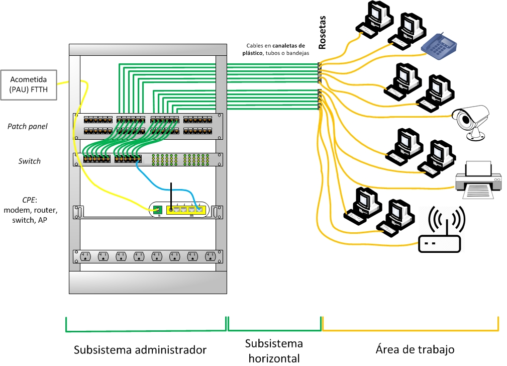
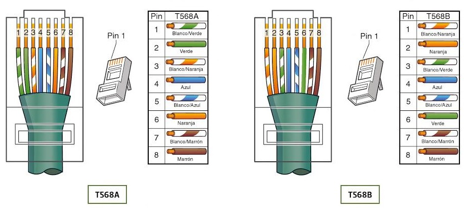

## Definición

El cableado estructurado es la base física que permite conectar y gestionar redes de voz, datos y video dentro de una organización, ofreciendo flexibilidad, escalabilidad y facilidad de mantenimiento.

Un Sistema de Cableado estructurado es el conjunto de cables, conexiones, canalizaciones, espacios y demás dispositivos que deben ser instalados para establecer una infraestructura de telecomunicaciones flexible y segura en un edificio.

La instalación de todos los elementos debe cumplir los estándares correspondientes para que se califique de cableado estructurado, esto supone un beneficio para su administración y gestión. Está pensado para hacer frente a las modificaciones y el crecimiento de la instalación.

En un sistema de cableado estructurado todos los dispositivos finales están conectados a un punto central para facilitar la interconexión con cualquier dispositivo y la administración del sistema desde cualquier lugar.
## Ventajas
Antes de proceder al diseño de la red se han de tener en cuenta muchos factores que van a repercutir en la elección de unas características u otras. Todos ellos deben ser tenidos en cuenta para poder realizar un correcto dimensionado de la infraestructura que se adapte tanto a las necesidades actuales como futuras.

* Facilidad y flexibilidad de mantenimiento.
* Integración de señales.
* Facilidad de instalación y de ampliación (escalabilidad).
* Aumento de la seguridad, tanto a nivel de datos como a nivel de seguridad personal.
* Alta velocidad de transmisión.

## Espacios. Subsistemas
El cableado estructurado se divide en subsistemas más pequeños, cada uno de los cuales tiene una función determinada dentro del sistema global.
Se puede abordar el diseño y montaje del cableado de una LAN por partes, cada una de ellas independientemente de las demás, lo que facilita la instalación y mantenimiento
posterior. 

??? tip "Consejo oculto"
    Un sistema de cableado estructurado incluye canalizaciones, medios de transmisión, conectores y paneles.
 
Podemos distinguir las siguientes partes:

  * **Cableado vertical** o **Backbone**: Es la parte troncal de la instalación, conecta diferentes plantas, por tanto, hay que tener especial cuidado porque cualquier disminución del rendimiento en este cableado afectaría a toda la instalación.
  * **Cableado Horizontal**: El cableado horizontal facilita la comunicación dentro de la planta, va desde el área de trabajo hasta el armario de comunicaciones.
  * **Entrada al edificio**: Es la acometida de red, incluye la acometida telefónica, los cables y dispositivos necesarios para conectar a proveedores externos.
  * **Cuarto de comunicaciones**: Conecta el subsistema de cableado horizontal con el subsistema vertical.
  * **Áreas de Trabajo**: Los componentes del área de trabajo son los existentes entre la salida del armario de telecomunicaciones y el equipo del usuario. Esta parte de la instalación no está incluida en el estándar.
* **Armarios de comunicaciones** .

### Subsistema horizontal
Se debe considerar su proximidad con el cableado eléctrico que genera altos niveles de interferencia electromanética (motores, elevadores, transformadores etc) y cuyas limitaciones se encuentran en el estándar ANSI/EIA/TIA 569.

La máxima longitud permitida independientemente del tipo de medio de TX utilizado es 100 metros = 90 m + 3m usuario + 7 m patchpannel.

### Subsistema vertical
El propósito del cableado vertical (*backbone*) es proporcionar interconexiones entre cada uno de los concentradores y conmutadores, que a través del cableado horizontal controlan las distintas áreas de trabajo, y el o los de telecomunicaciones establecidos en el diseño de la red.
### Area de trabajo
Cada área de trabajo tiene una o varias tomas de usuario. En cada uno de ellos habrá una roseta de conexión que permite
conectar el equipo o equipos que se quieran integrar en la red.
### Cuarto de telecomunicaciones y armarios
El cuarto de telecomunicaciones (TC- *Telecommunications
Closet*) es el área exclusiva dentro de un edificio para albergar los equipos de la red local de interconexión entre cada uno de los subsistemas del cableado estructurado.

Es un espacio cerrado de un edificio utilizado para el uso exclusivo de cableado de telecomunicaciones y sistemas auxiliares: bastidores (*racks*), concentradores, aire acondicionado propio…

Un **rack** es un soporte metálico destinado a alojar equipamiento electrónico, informático y de comunicaciones. También son llamados *bastidores*, cabinas, cabinets o armarios.
Deben de contar con al menos 82 cm de espacio libre por delante y por detrás. Las medidas para la anchura están
normalizadas para que sean compatibles con equipamiento de cualquier fabricante (19”).
La altura interior de los racks se mide en unidades de altura conocidas como **unidades U**. Una unidad de altura U equivale a 50 milímetros de longitud.

En una instalación para una red de ordenadores se instala al menos un rack por planta. El de la planta baja suele ser el principal (a menos que se trate de una red de varios edificios).

## Estándares
La instalación debe cumplir normas internacionales (ANSI/TIA-568, ISO/IEC 11801) y nacionales (NOM-001-SEDE), asegurando seguridad, compatibilidad y auditorías confiables.

Algunos de los organismos encargados de normalizar o regular el cableado estructurado son:

La normativa de cableado estructurado en España es la que aplica los estándares europeos (EN) que están a cargo de CEN/CENELEC.
La adaptación de los principios EN a las normas de nuestro país está a cargo de AENOR, dando lugar a los estándares UNE EN.

* UNE EN 50310. Diseño del edificio
* UNE EN 50173. Diseño y distribución del SCE
* UNE EN 50174. Planificación del SCE

A la hora de hacer las conexiones, la norma EIA/TIA 568A - B especifica la disposición de colores que llevarán ambos extremos del cable de par trenzado al unirlos a los conectores RJ45.

## Diagnóstico
Cuando se instalan cables de par trenzado en el cableado vertical, horizontal o área de trabajo, así como cualquier latiguillo de parcheo, es necesario verificar mediante pruebas de diagnóstico la ausencia de errores.

Mediante el **diagnóstico** se prueba la funcionalidad del cableado, determinando si este puede transportar señales entre sus extremos dentro de los parámetros de calidad
establecidos por los estándares, analizando cuestiones como:

* Eficiencia de transmisión de la señal a través del cable.
* Interferencias en la señal durante la transmisión.
* Atenuación de la señal durante la transmisión.

## Certificación
La **certificación** del cableado estructurado es el proceso de prueba y análisis por el que se establece la seguridad de que dicho cableado cumple con unos parámetros de calidad
establecidos en estándares, y especificados en contrato, atendiendo a la calidad del cable utilizado.

Las pruebas de certificación se llevan a cabo con personal capacitado y con equipos calibrados y certificados por laboratorios nacionales o internacionales y para validar que la funcionalidad y rendimiento del cable estén al menos dentro de lo que indican los estándares.

!!! note
    Una red que no está certificada no está terminada.

