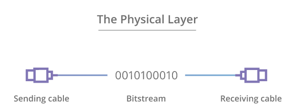
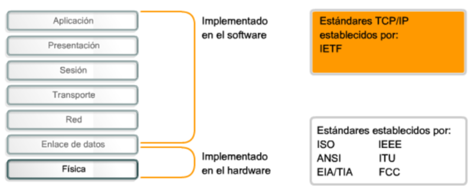

## Capa Física

La capa Física del modelo OSI proporciona los medios de transporte para los bits que conforman la trama de la capa de Enlace de datos a través de los medios de red. 

Esta capa acepta una trama completa desde la capa de Enlace de datos y la codifica como una secuencia de señales que se transmiten en los medios locales. Un dispositivo final o un dispositivo intermediario recibe los bits codificados que componen una trama.

La capa física se encarga de definir todos los aspectos relacionados con los elementos físicos de conexión de los dispositivos a la red, así como de establecer los procedimientos para transmitir la información.

Puede decirse que la capa física es la encargada de definir cuatro tipos de características de los elementos de interconexión:

* **Mecánicas**: se refiere a las características físicas del elemento de conexión con la red, es decir, a las propiedades de la interfaz física con el medio de comunicación. Por ejemplo, las dimensiones y forma del conector, el número de cables usados en la conexión, el número de pines del conector. el tamaño del cable, el tipo de antena, etc.
* **Eléctricas**: especifica las características eléctricas empleadas, por ejemplo, la tensión usada, velocidad de transmisión, intensidad en los pines. etc.
* **Funcionales**: define las funciones de cada uno de los circuitos del elemento de interconexión a la red, por ejemplo, pin X para transmitir, pin Y para recibir, etc.
* **De procedimiento**: establece los pasos a realizar para transmitir información a través del medio físico.
  
## Medios de transmisión

La transmisión de datos entre un emisor y un receptor siempre se realiza a través de un medio de transmisión. Los medios de transmisión se pueden clasificar como guiados y no guiados. En ambos casos, la comunicación se realiza usando **ondas electromagnéticas**. 

La capa física produce la representación y las agrupaciones de bits para cada tipo de medio de la siguiente manera:

* Cable de cobre: las señales son patrones de pulsos eléctricos.
* Cable de fibra óptica: las señales son patrones de luz.
* Conexión inalámbrica: las señales son patrones de transmisiones de microondas.

En la figura, se muestran ejemplos de señalización para medios inalámbricos, de cobre y de fibra óptica.

## Estándares de la capa física
Para habilitar la interoperabilidad de la capa física, los organismos de estandarización rigen todos los aspectos de estas funciones.

Los protocolos y las operaciones de las capas OSI superiores se llevan a cabo en software diseñado por ingenieros en software e informáticos. El grupo de trabajo de ingeniería de Internet (IETF) define los servicios y protocolos del conjunto TCP/IP.

La capa física consta de circuitos electrónicos, medios y conectores desarrollados por ingenieros. Por lo tanto, es necesario que las principales organizaciones especializadas en ingeniería eléctrica y en comunicaciones definan los estándares que rigen este hardware.

Existen muchas organizaciones internacionales y nacionales, organizaciones de regulación gubernamentales y empresas privadas que intervienen en el establecimiento y el mantenimiento de los estándares de la capa física. Por ejemplo, los siguientes organismos definen y rigen los estándares de hardware, medios, codificación y señalización de la capa física:

* Organización Internacional para la Estandarización (ISO)
* Asociación de Industrias Electrónicas - Asociación de las Industrias de las Telecomunicaciones (EIA/TIA)
* Unión Internacional de Telecomunicaciones (ITU)
* Instituto Nacional Estadounidense de Estándares (ANSI)
* Instituto de Ingenieros Eléctricos y Electrónicos (IEEE)
* Federal Communication Commission (FCC), autoridad nacional reguladora de las telecomunicaciones de EEUU
* Instituto Europeo de Estándares de Telecomunicaciones (ETSI)

## Flujo de datos
El modo de transmisión describe la dirección del flujo de señal entre dos dispositivos. 

* En la transmisión *simplex*, las señales se transmiten sólo en una única dirección; siendo una estación la emisora y otra la receptora. 
* En *half-duplex*, ambas estaciones pueden transmitir, pero no simultáneamente. 
* En *full-duplex*, ambas estaciones pueden igualmente transmitir y recibir, pero ahora simultáneamente. En este último caso, el medio transporta señales en ambos sentidos al mismo tiempo.

## Tipos de Señales
Toda señal electromagnética, considerada como función del tiempo, puede ser tanto analógica como digital.

* Una señal **analógica** es aquella en la que la intensidad de la señal varía suavemente en el tiempo. Es decir, no presenta saltos o discontinuidades. (Función continua)
* Una señal **digital** es aquella en la que la intensidad se mantiene constante durante un determinado intervalo de tiempo, tras el cual la señal cambia a otro valor constante. (Valores discretos)

La señal continua se puede corresponder a voz y la señal discreta puede representar valores binarios (0 y 1).  Una señal digital, en origen, siempre tendrá menos precisión que una señal analógica. Su virtud estriba en que puede ser regenerada después de ser interferida en la transmisión, la analógica no.

La conversión de una señal analógica en digital se realiza mediante procedimiento denominado "**Modulación por impulsos codificados**" (PCM) o "**Modulación por códigos de pulsos**". Este sistema se basa en tres operaciones: muestreo, cuantificación y codificación.

* **Muestreo**: En esta fase, la señal analógica original, que forma parte de la señal combinada de video compuesto, se transforma en una serie de impulsos llamados muestras.
* **Cuantificación**: En esta fase, se asigna un valor a cada una de las muestras tomadas en el paso anterior.
* **Codificación**: En esta fase, se convierte los valores obtenidos de la cuantificación a código binario.
  

## Ancho de banda (*Bandwidth*)

La transferencia de datos se analiza en términos de ancho de banda y rendimiento.

El ancho de banda es la capacidad de un medio para transportar datos. El ancho de banda digital mide la cantidad de datos que pueden fluir desde un lugar hacia otro en un período de tiempo determinado. Se mide en bits por segundo (bps - kbps - Mbps - Gbps). 

Los términos utilizados para medir la calidad del ancho de banda incluyen:
* **Latencia** (*Latency*). Tiempo que tarda una solicitud o datos en viajar desde su origen hasta el destino.
* **Rendimiento** (*Throughput*). Tasa de transferencia efectiva.  Medida de la cantidad total de datos que se pueden transmitir desde un origen al destino en un período de tiempo específico. Es decir, mide la cantidad de paquetes que llegaron con éxito a un destino. Se suele medir en Mbps o Gbps.
* **Capacidad de transferencia útil** (*Goodput*). La capacidad de transferencia útil es el rendimiento menos la sobrecarga de tráfico para establecer sesiones, acuses de recibo, encapsulación y bits retransmitidos. La capacidad de transferencia útil siempre es menor que el rendimiento, que generalmente es menor que el ancho de banda.	

La diferencia entre *goodput* y *throughput* es que el throughput es la medición de todos los datos que fluyen a través de un enlace, ya sean datos útiles o no, mientras que goodput se centra solo en datos útiles.
## Perturbaciones en la transmisión
En cualquier sistema de comunicaciones se debe aceptar que la señal que se recibe diferirá de la señal transmitida debido a varias adversidades y dificultades sufridas en la transmisión. En las señales analógicas, estas dificultades pueden degradar la calidad de la señal. En las señales digitales, se generarán bits erróneos: un 1 binario se transformará en un 0 y viceversa.

Las dificultades más significativas son:

* La atenuación y la distorsión de atenuación.
* La distorsión de retardo.
* El ruido.
## Codificación y  señalización
La **codificación**  es un método que se utiliza para convertir una transmisión de bits de datos en un “código” predefinido. Los códigos son grupos de bits utilizados para ofrecer un patrón predecible que pueda reconocer tanto el emisor como el receptor. En el caso de las redes, la codificación es un patrón de voltaje o corriente utilizado para representar los bits; los 0 y los 1.

El método de representación de bits se denomina **señalización**. Los estándares de la capa física deben definir qué tipo de señal representa un “1” y qué tipo de señal representa un “0”. Esto puede ser tan simple como un cambio en el nivel de una señal eléctrica o de un pulso óptico. Por ejemplo, un pulso largo puede representar un 1, mientras que un pulso corto representa un 0.

## Modulación
La modulación permite transmitir datos digitales mediante señales analógicas convirtiendo los datos a un formato analógico. 

La modulación consiste en modificar una señal continua de frecuencia  constante, denominada **señal portadora**, para representar la información que se quiere transmitir.
La frecuencia de la señal portadora debe ser compatible con las características del medio de transmisión que se vaya a utilizar. La señal que se obtiene y que se enviará por el medio tendrá un ancho de banda en torno a la frecuencia de la portadora.

Existen varias técnicas de modulación. Todas ellas implican la modificación de uno o más de los parámetros fundamentales (amplitud, frecuencia y fase) de la señal portadora.
Las técnicas básicas de modulación son:

* Modulación por desplazamiento de amplitud (*Amplitude-Shift Keying* - ASK)
* Modulación por desplazamiento de frecuencia> (*Frequency-Shift Keying* - FSK)
* Modulación por desplazamiento de fase (*Phase-Shift Keying* - PSK)

## Multiplexación
La multiplexación es una técnica utilizada en comunicaciones mediante la cual en un canal pueden convivir señales procedentes de distintos emisores y cuyo destino son diferentes receptores. Es decir, se comparte un canal físico, estableciendo sobre él varios canales lógicos.

Cuando un medio o canal es compartido por varios emisores que desean transmitir a la vez, este debe multiplexarse. La multiplexación significa que se reserva parte del canal a cada emisor.