# Implementación de una red

## Paso 1: Diseño del sistema
El primer paso a la hora de instalar un sistema de cableado estructurado es realizar un buen diseño del mismo atendiendo a cuestiones como la disposición física del edificio, así como a las necesidades presentes y futuras del negocio. O sea, hay que configurarlo para que permita actualizaciones y expansiones posteriores.

!!! Nota

    En la planificación hay que tener en cuenta la proyección de crecimiento de la red lo que implica el número de dispositivos conectados, la necesidad de mayor velocidad, la capacidad de almacenamiento o nuevas tecnologías que puedan surgir.

Es la fase previa de planificación en la que hay que identificar requerimientos como las necesidades de la red, incluyendo la cantidad de dispositivos que se conectarán lo que determinará la cantidad de cable necesario y la capacidad y rendimiento que se espera de la red. Sobre este particular, se aconseja tener en cuenta el margen adicional para futuras expansiones.

Este plan ha de contemplar igualmente el ancho de banda necesario y la definición de la topología -cómo se organizará todo-, así como la creación de diagramas de la red que muestren cómo se conectarán los dispositivos y cómo se repartirá el cableado en el edificio.

Otra cuestión importante es precisamente la distribución física de los equipos y las tomas. Una buena ubicación y colocación es aval de una mejor calidad de las conexiones al minimizar las distancias y evitar las pérdidas de señal o interferencias. Además de facilitar el acceso para el mantenimiento y posibles actualizaciones.

## Paso 2: Selección de los materiales y preparación de herramientas
Tras realizar el diseño hay que seleccionar el tipo de cable y otros componentes necesarios para el proyecto como conectores, paneles de conexión, tomas de corriente, canaletas y otros. Es importante esta elección porque determinará el rendimiento final de la red por lo que hay que comprobar que cables y hardware admitan las velocidades de transmisión requeridas y que se garantiza la compatibilidad entre los diferentes componentes.

El corazón de cualquier instalación son los cables. Dependiendo de las necesidades se puede optar por cables UTP, STP, fibra óptica… La elección debe basarse en factores como la distancia, el tipo de datos a transmitir y el ambiente en el que se instalarán. Por ejemplo, para grandes distancias sin interferencia, la fibra óptica es la mejor opción.

???+ note "Pregunta"

    ¿Qué norma se utiliza para realizar cable UTP directo?

    ??? question "Respuesta"

        TIA/EIA-568B en ambos extremos

Por otro lado, están las canaletas que, además de ser un componente estético, es un elemento de protección puesto que evitan que los cables estén expuestos a factores externos que puedan dañarlos, facilitando su organización y mantenimiento. En este sentido, es importante elegir canaletas de buena calidad, que resistan factores ambientales si están al aire libre y que tengan un tamaño adecuado para la cantidad de cables que alojarán.

Y otras soluciones que forman parte de muchas de estas instalaciones son los racks que hacen posible organizan los dispositivos, como switches, routers y servidores. Además, proporcionan ventilación para evitar el sobrecalentamiento. Cuando se elige un armario hay que tener en cuenta el espacio, el número de equipos a instalar y la facilidad para realizar conexiones o mantenimientos.

Junto a los materiales, hay que adquirir las herramientas que nos permitirán hacer la instalación como pelacables, cortadoras de cables, destornilladores, crimpadoras, etcétera. Así como bridas y etiquetas que contribuyen a mantener el sistema ordenado y facilitarán futuras intervenciones.

!!! warning "¡Cuidado!" 
    Esto es una advertencia. 
    Atención: Respetar las normas de seguridad oportunas para evitar cortes!

## Paso 3: Montaje: instalación del cableado estructurado
Diseño hecho y materiales listos, el siguiente paso es la instalación de los cables. Esto implica hacer agujeros, pasar cables a través de paredes y techos, y conectarlos a los paneles de parcheo.

En esta etapa seleccionar el sitio adecuado, proteger los equipos y garantizar un sistema eficiente resulta vital. Por ejemplo, si se instala un rack de comunicaciones hay que tener en cuenta que debe estar en un lugar accesible para los técnicos, permitiendo intervenciones y mantenimientos con facilidad. Y con espacio adicional para futuras expansiones. Debe contar con suficiente ventilación para evitar sobrecalentamientos y estar alejado de fuentes de interferencia electromagnética.

Otro aspecto importante es asegurarse de que el lugar de la instalación del sistema de cableado estructurado es fresco y está libre de humedad para cerciorarse de que equipos y cables conservan su integridad.

En este proceso hablamos de instalar canaletas o tubos en las parades y techos para contener los cables de manera ordenada y protegerlos. De instalar cableado horizontal desde las tomas de corriente en las áreas de trabajo hasta los paneles de conexión en los cuartos de telecomunicaciones; y del cableado troncal que conectará los diferentes cuartos de telecomunicaciones.

Uno de los primeros pasos del montaje es la instalación de entrada y supone decidir por dónde ingresarán los cables y cómo se distribuirán en el espacio. Es esencial garantizar que las entradas estén protegidas contra el polvo, agua o cualquier otro elemento que pueda dañar los cables. Además, planificar una ruta lógica y eficiente para los cables puede reducir la necesidad de intervenciones futuras.

Una vez que los cables han ingresado al espacio designado, la distribución interna se encarga de llevar cada cable a su destino correspondiente. La clave aquí es la organización. Como consejos: utilizar etiquetas para identificar cables, agruparlos según su función y evitar cruzamientos innecesarios. El objetivo es que, a simple vista, cualquier técnico pueda identificar y acceder a cualquier cable sin inconvenientes.

!!! info "La importancia del cuarto de telecomunicaciones"

    Se entiende por un cuarto de telecomunicaciones un espacio centralizado y exclusivo en un edificio donde se aloja, organiza y conecta el equipamiento y el cableado de redes como voz, datos, televisión e internet. Alberga elementos pasivos como racks y paneles de parcheo, y equipos activos como switches, routers y firewalls, siendo el punto neurálgico para la distribución de la información a lo largo de todo el edificio. 

## Paso 4: Conexión de los componentes
Una vez instalados los cables con las mini obras pertinentes llega la hora de conectar todos los componentes del sistema. A saber, switches, routers y otros dispositivos de conexión.

En este proceso se deben instalar los paneles de conexión en los cuartos de telecomunicaciones y posteriormente conectar los cables de cableado horizontal a los paneles.

Dos aspectos importantes en esta fase es el asegurarse de seguir las normas de cableado estructurado para asegurar la funcionalidad de la red y etiquetar cada cable de manera única en ambos extremos para identificar fácilmente su ubicación y función.

## Paso 5: Pruebas y verificación
La siguiente etapa consiste en probar y certificar la instalación. Esto implica verificar que cada cable funciona correctamente y que el sistema en su conjunto cumple con las normas y especificaciones técnicas.

Se llevan a cabo pruebas para garantizar la continuidad de cada cable y asegurarse de que estén conectados correctamente; además de test de velocidad y rendimiento de la red para comprobar que cumple con los requisitos previstos.

## Paso 6: Documentación
Otro de los puntos a tener en cuenta en este procedimiento es documentar todos los aspectos del cableado, incluyendo diagramas, ubicación de cables, identificación de los mismos y otros detalles.

## Paso 7: Mantenimiento y gestión
El proceso de instalación de cableado estructurado no acaba una vez que está todo acoplado y funcionando. Requiere de un mantenimiento regular y unas actualizaciones periódicas. Desde el empleo de organizadores para conservar los cables ordenados y evitar enredos, hasta la obligatoriedad de realizar mantenimientos regulares para cerciorarse de que el cableado está en buen estado y operando correctamente, comprobando que no hay desgaste, daños o fallos de los componentes.

### 🖧 Diagrama de red propuesto

```mermaid
graph TD
    A[Proveedor de Internet] --> B[Rou­ter]
    B --> C[Switch Principal - Rack]
    C --> D[Switch Planta 1]
    C --> E[Switch Planta 2]
    D --> F(PCs / Oficinas Planta 1)
    E --> G(PCs / Oficinas Planta 2)
    C --> H[Servidor / NAS]
```

